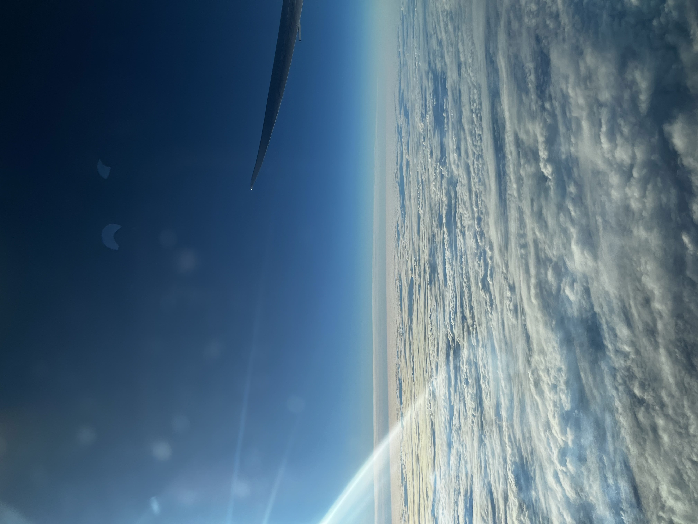
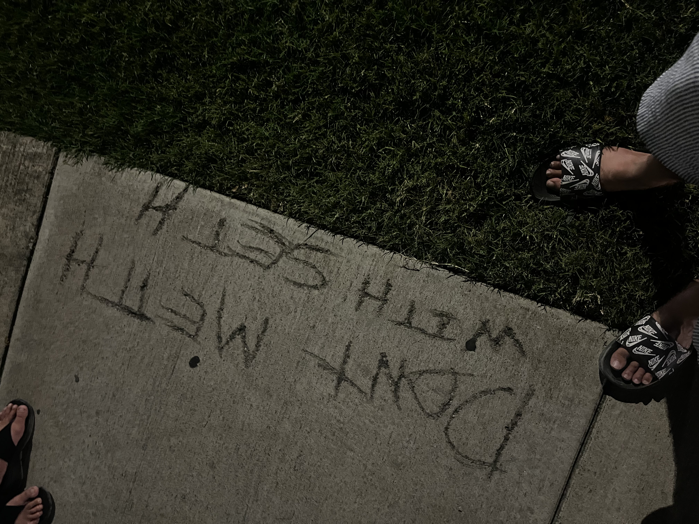
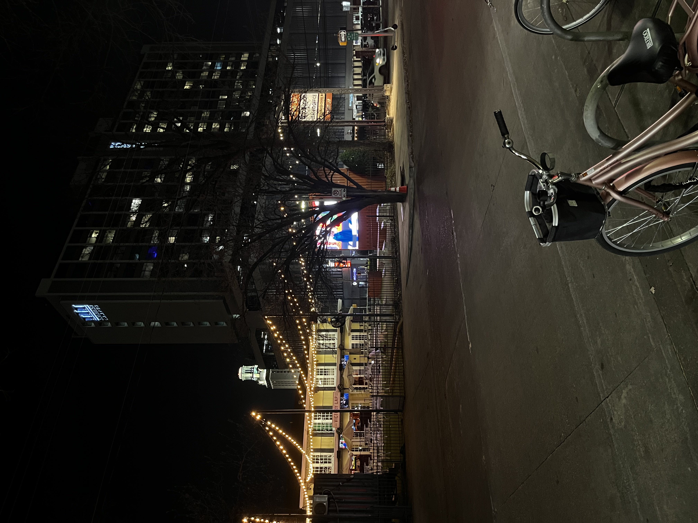
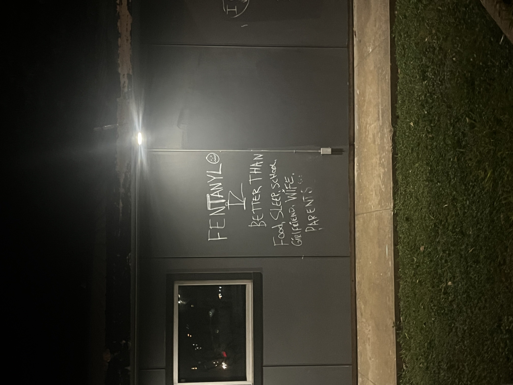
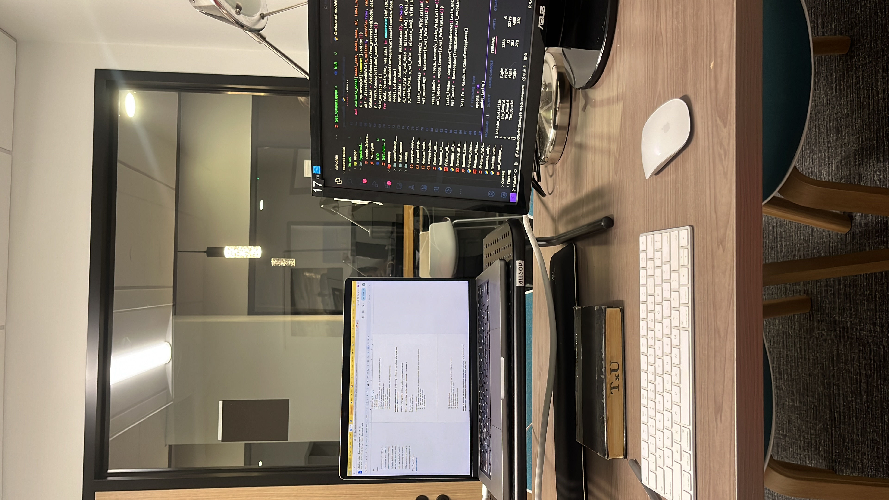

## Changes, Introspection, and my first eight months

I moved to the USA on January 13th, 2024 with big dreams and ambitions, expecting to rapidly transform myself into the best version of me. This is a trend I have observed with myself over the last few major changes in my life (college, internships, jobs, etc) - where I try to amalgamate tangible change with a mentality change. What followed was a journey of realization, growth, and, in some cases, unexpected outcomes. This transformation (or search for perfection if we are feeling optimistic) would see me transforming into a fit, smart individual surrounded by brilliant people, and, of course, deeply involved in meaningful research that would eventually lead to groundbreaking work. But, as with most things in life, what you imagine and what actually happens are often two very different things.

*Clouds are really beautiful, sometimes.*

### Initial Expectations: Aiming High

Before I left for the U.S., I had this mental list of things I was certain I would achieve. I thought by this point, I would have published my first paper. I imagined I’d be fitter, stronger, healthier, hitting the gym every day and transforming my body. And of course, I thought I would be smarter—not just academically, but in every sense of the word.

Looking back, the reality is far from what I expected. I haven’t published anything yet, and while I’ve become smarter in some ways, I haven’t really transformed physically the way I thought I would. What stands out now, in retrospect, is how I never really stopped to ask myself what was truly important. I was caught up in the idea of achievement without considering whether these specific goals were the ones that mattered most.

That’s the funny thing about expectations—they can blind you to what’s really happening in the present. You get so focused on where you think you should be that you miss the value of where you are (ChatGPT came up with this end to the paragraph after I failed mutiple times, you can be the judge of how good it was).

### The Unexpected Reality of Loneliness

Loneliness is an inevitable part of moving to a new country. People will, and they should, tell you that this is an untrue statement but it was unforutnately true for me. For me, more so, it was twofold. On one hand, I missed my family and friends back home, the people who had been my support system for so long. On the other hand, I found it difficult to form the kind of deep, meaningful connections I was used to. Most of the social groups here seemed to form around specific interests—people bonded over football, gym workouts, research, or food. There was a structure to socializing that I wasn’t familiar with.

Back home, friendships felt more stochastic, more organic. I’ve always cherished the randomness of friendships that just happen without being tied to a specific activity. But here, I quickly realized that the concept of friendship often centers around shared activities or common interests. To this, I should point out that throughout my life, I have had people who I hung out with because of certain mutual commonalities - playing a particular sport, friends of partners, roommates, etc. However, the freindships felt more "real". It’s not so much a philosophical reflection as it is a casual observation - Say, for example, it is a case of a friendship stemming more from some obscure deep connection and less from the simple fact that we play soccer together. It’s more like, ‘I’m not entirely sure why we’re friends, but I suppose soccer is a big part of it,’ rather than a straightforward acknowledgment of, ‘Oh, I know him from soccer.’”. I am too lazy to flesh this out. 

Despite that, my happiness wasn’t affected by the loneliness. I was always content, focusing on my personal goals and internal growth. What did change was my sense of identity. Being in a new country made me reflect on who I was outside of the social structures I was used to. It made me question what parts of my identity were tied to where I came from, and which parts were intrinsic to who I am.

*I like that people like telling you that they do drugs.*

### America Challenged My Notions of Being Indian

Being in the U.S. forced me to rethink my understanding of what it means to be Indian. Before moving, I had a somewhat simplistic and naive understanding of what being an Indian means. But living here, I encountered a wide spectrum of "Indians", each with their own relationship to what being Indian means.

On one end, you have Indians who’ve moved here and fully embraced American culture, sometimes even viewing it as superior to Indian culture. On the other end, there are Indians who are here solely for work or other practical reasons but still hold tightly to Indian traditions, foods, and ways of thinking. I don’t fit neatly into either category.

This pushed me to redefine my own identity. I realized that being Indian isn’t just about where you were born or even what you do day-to-day. It’s more complex than that, a blend of heritage, values, and personal choices. I began to consciously decide which aspects of Indian culture I wanted to keep and which I wanted to move away from. For example, staying vegetarian has always been a part of my identity, not because of religious reasons, but because I genuinely don’t want to harm animals. It’s something that has remained constant in my life, even though I’ve noticed a lot of people in the U.S. assume it’s tied to religion.

This process of self-discovery is ongoing. I’m more aware now of which cultural values resonate with me and which ones don’t. I feel more comfortable defining my own version of what it means to be Indian.

*Austin really likes yellow lighting.*

### The Journey of Personal Growth

Some of the things I’ve realized about myself were already there before moving to the U.S., but living here has reinforced them in a way that feels more concrete now. I’ve always wanted to be fit, but now, more than ever, I see the value in physical health, not just for the sake of appearance but as a way of life. I want to be strong, capable, and disciplined in my fitness journey. I also realized that expressing my identity—through things like tattoos—matters to me. It’s a form of self-expression that I hadn’t explored much before but am now actively thinking about.

There’s also the broader desire for personal excellence. I want to be highly educated, polylingual, a polymath. I want to drive well, cook well, and be the best version of myself in all aspects. Some of these aspirations have always been there, but living here has made them feel more achievable, more within my grasp. I’ve come to see these as lifelong pursuits, not as boxes to tick off, but as continuous journeys of improvement.

Interestingly, I’ve also realized what I don’t care about. Fame, societal acceptance, and conforming to norms aren’t things I’m interested in. I value hard work, knowledge, and self-growth over external validation. That realization has been liberating, freeing me from the pressure to meet expectations that don’t align with who I am.

*Is it better than Arsenal beating Spurs away without their starting midfield?*

### Research: A Path That’s Harder and More Rewarding Than I Imagined

(To be fair, this deserves more than just a paragraph sitting lazily in a bar, watching people.)

Perhaps one of the biggest surprises for me has been the reality of doing research. Before, I relied heavily on intuition—my ability to "feel out" a good idea and pursue it. That approach worked for me in many areas of life, but I’ve come to realize that research doesn’t work that way. You can’t just trust your gut; you have to back it up with academic rigor. You have to read papers, analyze data, and ensure that what you’re working on actually holds up to scrutiny.

It’s been a humbling experience. Research is far more challenging than I initially thought, but that’s also what makes it so much more rewarding. There’s something deeply satisfying about working through complex problems and knowing that you’re contributing something new to the world. The difficulty makes the progress all the more meaningful, and I’ve come to appreciate that.

It has also reinforced my belief that this is what I want to do long-term. The challenges I’ve faced haven’t discouraged me; they’ve only solidified my resolve. There’s something exciting about the possibility of solving problems that no one has solved before—of bringing something novel into the world. That sense of novelty, of contributing to something larger than myself, is what drives me to keep going.

As a smart individual (yes, I am a self-proclaimed erudite and I will stand by it), I feel that problem-solving is something that really is more fun than anything else. Dosteosvky, in his book, Memoirs from the House of the Dead (which at some point I will review), educates that the hardest thing to do is to not do anything (apologies for the gross oversimplification if you have read the book). If I have to do something for the rest of my life, I would problem solve. Research gives me that.

*Research, like most things, is pay to win.*

### Conclusion: TL;DR – What I’ve Learned

Moving to the U.S. has been a journey in every sense of the word. It’s challenged my expectations, reshaped my identity, and made me more aware of what matters most to me. I’ve learned that hard work, change, and freedom are essential to personal growth. I’ve come to value the depth of research, not just for the academic challenge, but for the potential to contribute something truly meaningful to the world.

And perhaps most importantly, I’ve learned a lot about myself. The move to America wasn’t just a geographical change—it was a mental and emotional one as well. It has helped me refine my goals, understand my values, and push myself toward becoming the person I’ve always wanted to be.

**What I am listening to:** Nobody Else Will Be There - The National

[Listen on Apple Music (sorry people with no iPhones)](https://music.apple.com/us/album/nobody-else-will-be-there/1233837225?i=1233837649)

